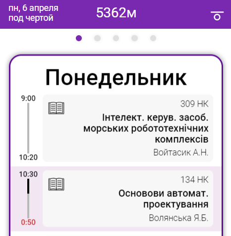

  <h1>Time Table</h1>
  
  

    The Progressive Web Applications of the lesson schedule for my university.
  

  <h3><a href="https://5362m.ml/">Demo</a></h3>

**The project is focused on mobile devices.**

*The main goal of the project development is programming training. This project may contain errors and use unnecessary or incorrect concepts, patterns, technologies, libraries and etc.*
*The project is updated as I learn to program.*

## What this application can do:

* Displaying the week below and above the line
* Shows an active day and a lesson
* Shows the progress of the lesson and the time left until the end of the lesson
* Switching to the next day at the end of all classes of the current day
* Progressive Web Application
* Button to install the PWA

## Technologies and libraries used in development:

* [Webpack](https://github.com/webpack/webpack)
* [Pug](https://github.com/pugjs/pug)
* [SCSS](https://github.com/sass)
* [Swiper](https://github.com/nolimits4web/swiper) - slider